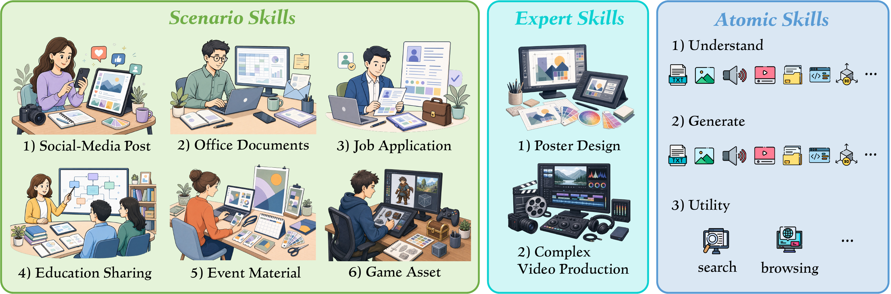
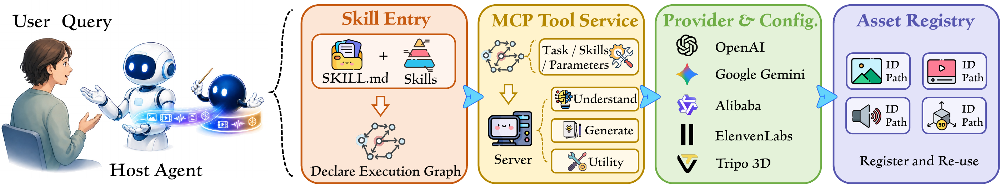
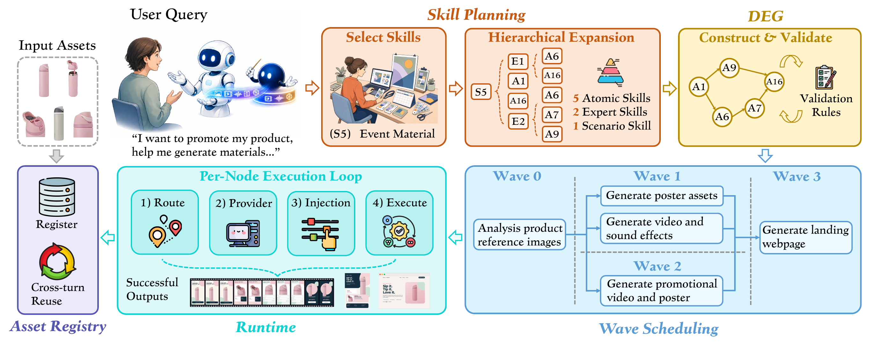

<div align="center">

<h1>
  
  Omni-IO Skills
</h1>

**Harnessing your coding agent to become omni-native—with multimodal eyes, ears, and creative tools.**

Omni-IO is a plug-and-play skill set and MCP runtime for understanding, creating, and coordinating images, video, audio, documents, 3D assets, code, and web content—all from natural-language requests.

<p>
  <a href="https://github.com/any2any-mllm/Omni-IO-Skill/stargazers"></a>
  <a href="https://agentskills.io/"></a>
  <a href="https://modelcontextprotocol.io/"></a>
  
</p>

<p>
  <a href="#news">News</a> ·
  <a href="#examples">Examples</a> ·
  <a href="#repository-structure">Repository Structure</a> ·
  <a href="#quick-start">Quick Start</a> ·
  <a href="#what-you-can-do">Capabilities</a> ·
  <a href="#how-it-works">How It Works</a> ·
  <a href="#citation">Citation</a>
</p>

</div>

<!--
PROMO VIDEO SLOT
Upload the final project video to GitHub, then place its user-attachment URL here.
Keep the video directly below the header and above News.
-->

## News

- **[Sep 2026]** We release **Omni-IO Skills**, a plug-and-play agent harness for omni-modal understanding, generation, and cross-modal workflows.

## Examples

<!--
Add each recorded example as one row. Put the prompt and any input assets in the
left column, and embed the corresponding output video in the right column.
-->

<table>
  <tr>
    <th width="50%">Input</th>
    <th width="50%">Output</th>
  </tr>
  <tr>
    <td>&nbsp;</td>
    <td>&nbsp;</td>
  </tr>
  <tr>
    <td>&nbsp;</td>
    <td>&nbsp;</td>
  </tr>
  <tr>
    <td>&nbsp;</td>
    <td>&nbsp;</td>
  </tr>
</table>

## Repository Structure

```text
Omni-IO-Skills/
├── SKILL.md                 # Entry point and routing index
├── skill.yaml               # Skill and MCP declaration
├── skills/                  # Atomic understanding, generation, and utility skills
├── expert/                  # Professional single-deliverable workflows
├── scenarios/               # Multi-deliverable application workflows
├── orchestration/           # Dependencies, review, interruption, and asset reuse
├── mcp/                     # Multimodal tool server
├── config/                  # Provider bindings and local credentials
├── formats/                 # Internal task declaration formats
├── setup/                   # Setup and provider documentation
└── assets/                  # README visuals and media
```

## Quick Start

Omni-IO works with hosts that can load an [Agent Skills](https://agentskills.io/) directory and connect to a local **stdio MCP server**. The commands below support macOS, Linux, and WSL and require Python 3.10+.

> [!TIP]
> Open this repository in Codex or Claude Code and ask: **“Install Omni-IO Skills for this host by following the README Quick Start.”** The agent can perform the local setup and tell you which optional credentials are needed for the capabilities you choose.

### 1. Install the runtime

```bash
git clone https://github.com/any2any-mllm/Omni-IO-Skill.git Omni-IO-Skills
cd Omni-IO-Skills

python -m venv .venv
source .venv/bin/activate
python -m pip install -r mcp/requirements.txt
playwright install chromium
```

`playwright install chromium` is needed only for the local browsing capability.

### 2. Create your local configuration

```bash
cp config/.env.example config/.env
```

Choose a persistent output directory with `OMNI_OUTPUT_DIR`. If you do not set one, Omni-IO uses `~/Documents/OmniIO`.

You do not need every API key. Start with the capabilities you want, add only their credentials to `config/.env`, and select providers in [`config/config.yaml`](config/config.yaml). See the [feature list](setup/feature_list.md) and [provider guide](setup/api_guide.md) for the available options.

> [!IMPORTANT]
> Keep `config/.env` private. It is ignored by Git and should never be committed.

### 3. Connect your agent

<details open>
<summary><strong>Codex</strong></summary>

```bash
mkdir -p "$HOME/.agents/skills"
ln -s "$(pwd)" "$HOME/.agents/skills/omni-io"

codex mcp add omni-io \
  --env OMNI_OUTPUT_DIR="$HOME/Documents/OmniIO" \
  -- "$(pwd)/.venv/bin/python" "$(pwd)/mcp/server.py"

codex mcp list
```

Start a new Codex session after setup.

</details>

<details>
<summary><strong>Claude Code</strong></summary>

```bash
mkdir -p "$HOME/.claude/skills"
ln -s "$(pwd)" "$HOME/.claude/skills/omni-io"

claude mcp add omni-io \
  --scope user \
  -e OMNI_OUTPUT_DIR="$HOME/Documents/OmniIO" \
  -- "$(pwd)/.venv/bin/python" "$(pwd)/mcp/server.py"

claude mcp list
```

Quit and reopen Claude Code after setup.

</details>

<details>
<summary><strong>Other Agent Skills + MCP hosts</strong></summary>

Point the host's skill loader to this repository's root `SKILL.md`, then register a local stdio MCP server with:

| Field | Value |
|---|---|
| Command | `/absolute/path/to/Omni-IO-Skills/.venv/bin/python` |
| Arguments | `/absolute/path/to/Omni-IO-Skills/mcp/server.py` |
| Environment | `OMNI_OUTPUT_DIR=/absolute/path/to/a/persistent/workspace` |

The host must expose both the Skill and the MCP server to the same agent session.

</details>

### 4. Verify the setup

Start a new conversation and send:

```text
Check my Omni-IO configuration and tell me which capabilities are ready.
```

A working setup reports which capabilities are ready, which need credentials, and which have key-free paths. If the MCP server connects but the Skill does not appear, verify the symlink and restart the host.

For a longer walkthrough, see [`setup/quickstart.md`](setup/quickstart.md).

## One request. Many modalities. One reusable workflow.

Most agent setups treat every media tool as a separate integration. Omni-IO gives the host agent one coherent workflow: it understands the request, selects the right skills and providers, executes independent work in parallel, reviews professional deliverables, and keeps successful outputs available for later reuse.

| Understand | Create | Coordinate | Reuse |
|---|---|---|---|
| Inspect images, video, audio, documents, and 3D assets | Generate media, documents, code, and complete deliverables | Plan multi-step jobs with dependency-aware execution | Refer to prior outputs naturally across tasks and restarts |

Omni-IO keeps your existing agent as the reasoning core. The repository adds the skills, tools, provider routing, and persistent asset layer around it.

## What You Can Do

<p align="center">
  
</p>

### Work with individual modalities

| Modality | Understand | Create |
|---|---|---|
| Image | Visual analysis, description, OCR | Text-to-image and reference-guided generation |
| Video | Scene analysis and subtitle extraction | Video generation and multi-shot production |
| Audio | Speech recognition and audio classification | Speech, music, and sound effects |
| Documents | Extract content from PDF, Word, PowerPoint, and Excel | Generate PDF, Word, PowerPoint, and Excel files |
| 3D | Inspect geometry and render previews | Generate 3D assets |
| Code & web | Browse and search for supporting information | Generate code, Markdown, and webpages |

### Produce complete deliverables

Omni-IO can route a request through three levels of work:

- **Atomic Skills** handle one focused operation, such as analyzing an image or generating speech.
- **Expert Skills** assemble and review one polished artifact, such as a poster or a multi-shot video.
- **Scenario Skills** coordinate a set of related deliverables for social media, office work, job applications, education, events, or game assets.

You describe the outcome. The host agent chooses the appropriate level automatically.

## How It Works

<p align="center">
  
</p>

1. **The Skill interprets the request.** It selects an atomic, expert, or scenario workflow and builds the task dependencies.
2. **The MCP runtime executes the work.** Understanding, generation, and utility tools expose a consistent interface to the host agent.
3. **Configuration selects providers.** Each capability can use the provider configured in `config/config.yaml` without changing the higher-level workflow.
4. **The asset registry preserves outputs.** Successful files receive stable records so later requests can find and reuse them.

### Dependency-aware execution

<p align="center">
  
</p>

Omni-IO represents multi-step work as an internal dependency graph. Independent tasks can run in parallel; dependent tasks wait for their inputs. Expert workflows inspect the finished deliverable and selectively redo only the parts that failed review.

### Persistent asset reuse

Generated files are stored under `OMNI_OUTPUT_DIR` together with `registry.json`. You can refer naturally to “the last image,” “the previous video,” or another registered output without generating it again. Reuse continues across conversations and host restarts as long as the same output directory is used.

## Configuration

Omni-IO separates the workflow from the provider. You can change a backend in [`config/config.yaml`](config/config.yaml) while keeping the same user-facing request and skill behavior.

- Some capabilities can run locally or through host-native features, including document generation, code and Markdown generation, Edge TTS speech, local 3D inspection, and Playwright browsing.
- Model-backed generation, media understanding, transcription, and search can be enabled individually with provider credentials.
- Provider availability, pricing, and free allowances can change. Review [`setup/feature_list.md`](setup/feature_list.md) and [`setup/api_guide.md`](setup/api_guide.md) before choosing a backend.
- Changes to `config/.env` or `config/config.yaml` take effect after the MCP process restarts.

To isolate separate projects, assign each one a different `OMNI_OUTPUT_DIR`.

## FAQ

<details>
<summary><strong>Do I need every API key?</strong></summary>

No. Configure only the capabilities you plan to use. The initial configuration check identifies what is ready and what needs a credential, without blocking unrelated capabilities.

</details>

<details>
<summary><strong>Why did the Skill not trigger automatically?</strong></summary>

Confirm that the `omni-io` symlink points to this repository, then restart the host. The request must also involve multimedia understanding, generation, transformation, or a related multi-deliverable workflow.

</details>

<details>
<summary><strong>What should I do if the MCP server is disconnected?</strong></summary>

Run the server directly to expose the startup error:

```bash
source .venv/bin/activate
python mcp/server.py
```

Missing packages usually mean the virtual environment is inactive or `mcp/requirements.txt` was not installed. Fix configuration errors in `config/.env` or `config/config.yaml`, then restart the host.

</details>

<details>
<summary><strong>Why did changes to keys or providers not take effect?</strong></summary>

The MCP process reads `config/.env` and `config/config.yaml` when it starts. Restart the host—or just the `omni-io` MCP server—after changing either file.

</details>

<details>
<summary><strong>Does Omni-IO replace my model or agent?</strong></summary>

No. Your host agent remains the reasoning core. Omni-IO adds reusable instructions, multimodal tools, provider selection, workflow coordination, and persistent artifacts around it.

</details>

<details>
<summary><strong>Can I use only one capability?</strong></summary>

Yes. A one-step request routes directly to the relevant Atomic Skill. Expert and Scenario workflows activate only when the requested outcome needs broader production or coordination.

</details>

<details>
<summary><strong>Where are generated files stored?</strong></summary>

Under `OMNI_OUTPUT_DIR`, together with the persistent `registry.json`. The default is `~/Documents/OmniIO`.

</details>

## Community

Questions, bug reports, feature requests, and workflow ideas are welcome in [GitHub Issues](https://github.com/any2any-mllm/Omni-IO-Skill/issues). If Omni-IO is useful to you, consider starring the repository so more agent builders can find it.

## Citation

If you are interested in Omni-IO Skills, please contact [Yanlin Li](mailto:yanlin.li@u.nus.edu) or [Hao Fei](mailto:haofei7419@gmail.com). If you use this project in your research or applications, please cite our paper:


```bibtex
@article{li2026omniio,
  title   = {Omni-IO Skills: Harnessing Your Agent Omni-Native},
  author  = {Li, Yanlin and Hao, Mingyang and Wu, Shengqiong and Fei, Hao and Lee, Mong-Li and Hsu, Wynne},
  journal = {arXiv preprint arXiv:XXXX.XXXXX},
  year    = {2026}
}
```

## Star History

<p align="center">
  <a href="https://star-history.com/#any2any-mllm/Omni-IO-Skill&amp;Date">
    <picture>
      <source media="(prefers-color-scheme: dark)" srcset="https://api.star-history.com/svg?repos=any2any-mllm/Omni-IO-Skill&amp;type=Date&amp;theme=dark">
      <source media="(prefers-color-scheme: light)" srcset="https://api.star-history.com/svg?repos=any2any-mllm/Omni-IO-Skill&amp;type=Date">
      
    </picture>
  </a>
</p>
