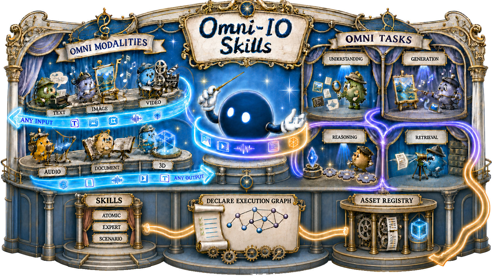

<div align="center">

<h1>
  
  Omni-IO Skills: Harnessing Your Agent Omni-Native
</h1>

<p>
  <a href="https://liyanlin06.github.io/">Yanlin Li</a><sup>1,†</sup>
  &nbsp;&nbsp;
  <a href="https://liyanlin06.github.io/">Mingyang Hao</a><sup>1</sup>
  &nbsp;&nbsp;
  <a href="https://sqwu.top/">Shengqiong Wu</a><sup>2</sup>
  &nbsp;&nbsp;
  <a href="https://haofei.vip/">Hao Fei</a><sup>2,‡</sup>
  &nbsp;&nbsp;
  <a href="https://www.comp.nus.edu.sg/cs/people/leeml/">Mong-Li Lee</a><sup>1</sup>
  &nbsp;&nbsp;
  <a href="https://www.comp.nus.edu.sg/cs/people/whsu/">Wynne Hsu</a><sup>1</sup>
</p>

<p>
  <sup>1</sup>National University of Singapore
  &nbsp;&nbsp;&nbsp;
  <sup>2</sup>University of Oxford
</p>

<p>
  <sup>†</sup><a href="mailto:yanlin.li@u.nus.edu">yanlin.li@u.nus.edu</a>
  &nbsp;&nbsp;
  <sup>‡</sup>Corresponding author and project lead:
  <a href="mailto:haofei7419@gmail.com">haofei7419@gmail.com</a>
</p>

<p>
  <a href="https://arxiv.org/"></a>
  <a href="https://github.com/any2any-mllm/Omni-IO-Skill"></a>
  <a href="https://github.com/any2any-mllm/Omni-IO-Skill/stargazers"></a>
  <a href="#quick-start"></a>
</p>

<p><strong>A plug-and-play Omni-modal Agent Harness for Codex, Claude Code, and other Agent Skills + MCP hosts.</strong></p>

<p>
  <a href="#news">News</a> ·
  <a href="#quick-start">Quick Start</a> ·
  <a href="#how-to-use">How to Use</a> ·
  <a href="#try-these-instructions">Try It</a> ·
  <a href="#faq">FAQ</a>
</p>

</div>

<p align="center">
  
</p>

<!--
DEMO VIDEO SLOT
Place the final GitHub user-attachment URL or an assets/demo.mp4 preview here.
This position is intentionally reserved immediately after the teaser.
-->

## News

- **[Sep 2026]** We release **Omni-IO Skills**, a plug-and-play Agent Harness for omni-modal understanding, generation, and cross-modal workflows.

## Repository Structure

```text
Omni-IO-Skills/
├── SKILL.md                 # Skill entry point and routing index
├── skill.yaml               # Skill and MCP declaration
├── skills/                  # Atomic understanding, generation, and utility Skills
├── expert/                  # Professional artifact-production Skills
├── scenarios/               # Application-level, multi-deliverable Skills
├── orchestration/           # Task dependencies and asset reuse
├── mcp/                     # Standardized multimodal tool server
├── config/                  # Provider bindings and local credentials
├── formats/                 # Internal task declaration formats
├── setup/                   # Setup and provider documentation
└── assets/                  # README and paper assets
```

## Quick Start

Omni-IO Skills works with any host agent that can load an [Agent Skills](https://agentskills.io/) compatible directory and connect to a local **stdio MCP server**. The Skill teaches the host how to plan multimodal work; the MCP server gives it the executable tools.

> [!NOTE]
> The commands target macOS, Linux, and WSL and require Python 3.10+. On native Windows, use PowerShell virtual-environment activation and absolute paths.

> [!TIP]
> **Agent-assisted setup:** open this repository in Codex or Claude Code and ask it to install Omni-IO Skills for the current host by following this Quick Start. Tell it which capabilities you want first, so it requests only the credentials you actually need.

### 1. Install the runtime

```bash
git clone https://github.com/any2any-mllm/Omni-IO-Skill.git Omni-IO-Skills
cd Omni-IO-Skills

python -m venv .venv
source .venv/bin/activate
python -m pip install -r mcp/requirements.txt
playwright install chromium
```

`playwright install chromium` is required only for the local browsing capability.

### 2. Configure the capabilities you need

```bash
cp config/.env.example config/.env
```

1. Review the [feature list](setup/feature_list.md) and choose the capabilities you want.
2. Add only their credentials to `config/.env`. Unused keys can remain blank.
3. If you want a different backend, change the corresponding `provider` in [`config/config.yaml`](config/config.yaml).
4. Keep `config/.env` private. It is ignored by Git and must never be committed.

The active values in `config/config.yaml` are the source of truth for provider selection. The [API guide](setup/api_guide.md) explains credential names and available alternatives.

Choose a persistent output directory as `OMNI_OUTPUT_DIR`. All generated files and the reusable asset registry are stored there. If omitted, the default is `~/Documents/OmniIO`.

### 3. Connect your host agent

#### Codex

Install the Skill in Codex's user-level skill directory and register the MCP server:

```bash
mkdir -p "$HOME/.agents/skills"
ln -s "$(pwd)" "$HOME/.agents/skills/omni-io"

codex mcp add omni-io \
  --env OMNI_OUTPUT_DIR="$HOME/Documents/OmniIO" \
  -- "$(pwd)/.venv/bin/python" "$(pwd)/mcp/server.py"

codex mcp list
```

Start a new Codex session after setup. If the Skill does not appear immediately, restart Codex.

#### Claude Code

Install the Skill in Claude Code's user-level skill directory and register the MCP server:

```bash
mkdir -p "$HOME/.claude/skills"
ln -s "$(pwd)" "$HOME/.claude/skills/omni-io"

claude mcp add omni-io \
  --scope user \
  -e OMNI_OUTPUT_DIR="$HOME/Documents/OmniIO" \
  -- "$(pwd)/.venv/bin/python" "$(pwd)/mcp/server.py"

claude mcp list
```

Quit and reopen Claude Code after setup.

<details>
<summary><strong>Other Agent Skills + MCP hosts</strong></summary>

Connect the host's skill loader to this repository's root `SKILL.md`, then register a local stdio MCP server with:

| Field | Value |
|---|---|
| Command | `/absolute/path/to/Omni-IO-Skills/.venv/bin/python` |
| Arguments | `/absolute/path/to/Omni-IO-Skills/mcp/server.py` |
| Environment | `OMNI_OUTPUT_DIR=/absolute/path/to/a/persistent/workspace` |

The host must expose the Skill and the MCP server to the same agent session.

</details>

### 4. Verify the installation

After restarting the host:

1. Confirm that `omni-io` appears in the host's MCP list and is connected.
2. Start a new conversation and send:

   ```text
   Check my Omni-IO configuration and tell me which capabilities are ready.
   ```

3. Confirm that it reports three groups: ready capabilities, capabilities that need credentials, and key-free capabilities.

If MCP registration succeeds but the Skill is not detected, confirm that the `omni-io` symlink points to this repository and then restart the host.

For a longer Claude Code walkthrough, see [`setup/quickstart.md`](setup/quickstart.md).

## How to Use

### Just describe the outcome

Omni-IO Skills triggers automatically when a request involves understanding, generating, transforming, or combining multimedia. You normally do **not** need to mention `omni-io`, choose a Skill, or name an MCP tool.

A useful instruction contains as many of these elements as the task requires:

```text
Input + Task + Deliverable + Constraints + Reuse
```

- **Input:** attach files, provide URLs, or give local paths that the host can access.
- **Task:** state what should be understood, created, transformed, or combined.
- **Deliverable:** specify the files you want, such as an image, video, audio track, document, 3D model, webpage, or a coordinated package.
- **Constraints:** include format, dimensions, aspect ratio, duration, language, style, required text, or target platform.
- **Reuse:** refer naturally to a previous result when it should be used again.

You can omit details you do not care about. The agent should ask only for missing choices that materially affect the result.

### What to expect

1. **First multimodal request:** the agent checks the active configuration once and tells you what is ready.
2. **Execution:** the agent chooses the appropriate Omni-IO Skills and providers automatically. Independent deliverables may run in parallel.
3. **Delivery:** completed files are returned with local paths. Professional deliverables are inspected before delivery when the required understanding capability is available.
4. **Later requests:** registered outputs can be found and reused without generating them again.

### Inputs, outputs, and cross-turn reuse

- Local inputs must remain accessible to the host for the duration of the task. If a path is outside the host's accessible workspace, attach the file or move it into an accessible directory.
- Generated files are written under `OMNI_OUTPUT_DIR`.
- The same directory contains `registry.json`, which records successful outputs and allows natural references such as “the last image” or “the video from the previous task.”
- Reuse works across conversations and host restarts as long as they point to the same `OMNI_OUTPUT_DIR` and `registry.json` is preserved.
- To keep separate projects isolated, give each project a different `OMNI_OUTPUT_DIR`.

<a id="try-these-instructions"></a>
## Try These Instructions

<table>
  <tr>
    <th width="28%">Task</th>
    <th width="72%">Instruction</th>
  </tr>
  <!-- Add instruction examples here. -->
</table>

## FAQ

<details>
<summary><strong>Do I need every API key?</strong></summary>

No. Configure only the capabilities you want. Where supported by the host, image understanding and code or Markdown generation are host-native. Local document generation, Edge TTS speech, local 3D inspection, and Playwright browsing also have key-free paths in the current configuration.

</details>

<details>
<summary><strong>How do I know the installation worked?</strong></summary>

Run `codex mcp list` or `claude mcp list` and confirm that `omni-io` is present and connected. Then start a new conversation and ask the agent to check the Omni-IO configuration. A successful check reports ready, missing, and key-free capabilities.

</details>

<details>
<summary><strong>Why did the Skill not trigger automatically?</strong></summary>

Confirm that the installation link exists at `$HOME/.agents/skills/omni-io` for Codex or `$HOME/.claude/skills/omni-io` for Claude Code and points to this repository. Restart the host after installing or changing the Skill. The request must also involve multimedia understanding, generation, transformation, or a related multi-deliverable workflow.

</details>

<details>
<summary><strong>What should I do if the MCP server is disconnected?</strong></summary>

Run the server directly from the repository to expose the startup error:

```bash
source .venv/bin/activate
python mcp/server.py
```

Missing packages usually mean the virtual environment is inactive or `mcp/requirements.txt` was not installed. Configuration errors should be fixed in `config/.env` or `config/config.yaml`. Restart the host after correcting the problem.

</details>

<details>
<summary><strong>Why did changes to API keys or providers not take effect?</strong></summary>

The MCP process reads `config/.env` and `config/config.yaml` when it starts. Quit and reopen the host, or otherwise restart its `omni-io` MCP server, after changing either file.

</details>

<details>
<summary><strong>Is Omni-IO Skills a new foundation model?</strong></summary>

No. It is an Agent Harness. It keeps the host agent's reasoning core unchanged and composes Skills, tools, specialist backends, execution control, and persistent artifacts around it.

</details>

<details>
<summary><strong>Can I use only one Atomic Skill?</strong></summary>

Yes. A one-step request routes directly to the relevant Atomic Skill. Scenario and Expert workflows activate only when the requested outcome needs broader coordination or professional assembly.

</details>

<details>
<summary><strong>Where are generated files stored?</strong></summary>

Under `OMNI_OUTPUT_DIR`, together with the persistent `registry.json`. If the variable is omitted, the default is `~/Documents/OmniIO`.

</details>

## Citation

<!-- Citation will be added after the public arXiv record is available. -->

---

<div align="center">

<strong>Keep the reasoning core. Make the agent omni-native.</strong>

<br><br>

<a href="https://github.com/any2any-mllm/Omni-IO-Skill">Code</a> ·
<a href="#quick-start">Install</a> ·
<a href="setup/api_guide.md">Provider Guide</a> ·
<a href="https://github.com/any2any-mllm/Omni-IO-Skill/issues">Issues</a>

</div>

<!-- PAPER LINK SLOT: replace the arXiv homepage URL with the public paper URL when available. -->

## Star History

<p align="center">
  <a href="https://star-history.com/#any2any-mllm/Omni-IO-Skill&amp;Date">
    <picture>
      <source media="(prefers-color-scheme: dark)" srcset="https://api.star-history.com/svg?repos=any2any-mllm/Omni-IO-Skill&amp;type=Date&amp;theme=dark">
      <source media="(prefers-color-scheme: light)" srcset="https://api.star-history.com/svg?repos=any2any-mllm/Omni-IO-Skill&amp;type=Date">
      
    </picture>
  </a>
</p>
